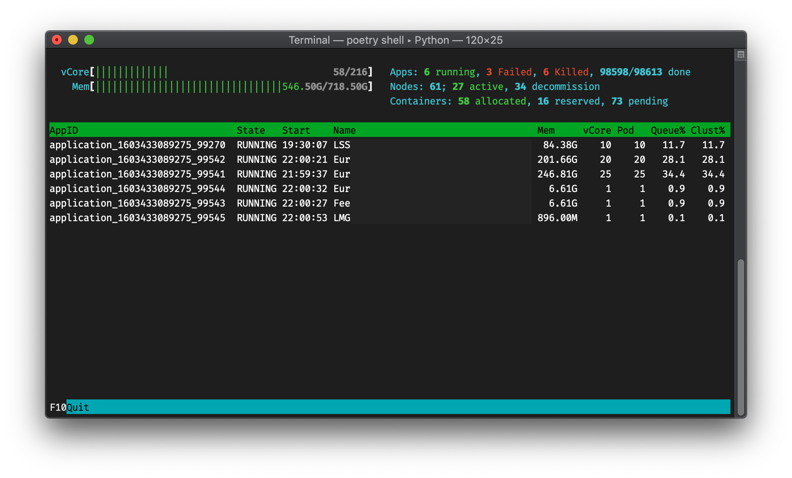

# hdtop

Top-liked monitoring console, for hadoop.



> **NOTE**
> This project is under development.
> Everything could be changed in the future- including the local config file format or syntax.


## Install

Required Python >= 3.6

```bash
pip install git+https://github.com/tzing/hdtop.git
```


## Usage

```bash
hdtop start <URL-to-hadoop-panel>  # just paste complete URL
```

This program uses [Hadoop ResourceManager REST API](https://hadoop.apache.org/docs/current/hadoop-yarn/hadoop-yarn-site/ResourceManagerRest.html) to get the latest status. As its API portal shared the same base URL with web UI. It would extract base URI from the given one.

For common used site, use `config` command to save the URL. Then this program could start without extra arguments:

```bash
hdtop config core.hadoopAddress <URL-to-hadoop-panel>
hdtop  # start UI
```
